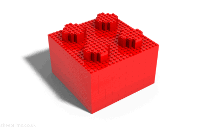

<!-- .slide: data-background="./reveal.js/img/title.png" -->

<!-- Presenter: Matt -->
# Widgets 101: Customizing and Creating Widgets with the ArcGIS API for JavaScript


### JC Franco – [@arfncode](https://twitter.com/arfncode)
### Matt Driscoll – [@driskull](https://twitter.com/driskull)

---

# Welcome


---

# Agenda

**Short URL: [bit.ly/widgets101](http://bit.ly/widgets101)**

- About widgets
- Building blocks
- Building a widget
  - 3.x
  - 4.x
- Tips & best practices
- Resources
- Q & A

---

# Widgets

- What?
  - Encapsulated
  - Cohesive
  - Single-purpose pieces of functionality 
  - User interface
- Why?
  - Reusable
  - Interchangeable
  - Modular
- How?
 - Different frameworks are available
 - Focusing on Dijit

---

# Dojo toolkit

- Foundation of ArcGIS JavaScript API
- AMD support
- Class-based inheritance
- Internationalization


---

# Dijit

- Dojo’s UI Library
- Separate namespace (dijit)
- Built on top of Dojo
- Has themes


---

# Asynchronous Module Definition (AMD)

- Asynchronous loading
- Web-based solution
- Lazy loading
- Fewer globals
- Dependency handling

---

# AMD example

- `define`
  ```js
  // moduleA.js
  define(["moduleB"], function (moduleB) {
    // module API
    return {
      _data: 100,
      calculate: function () {
        moduleB.calculate(this._data);
      }
    };
  });
  ```
- `require`
  ```js
  // main.js
  require(["moduleA"], function (moduleA) {
    moduleA.calculate();
  });
  ```

---

<!-- Presenter: JC -->
# Building blocks



---

# `dijit/_WidgetBase`

What you get

- Lifecycle
  - `constructor`
  - `postMixInProperties`
  - `buildRendering`
  - `postCreate`
  - `startup`
  - `destroy`
- Events
- Getters/Setters
- Property watching

---

# `constructor`

* Called immediately when widget is created
* Can be used for initialization

  ```js
  constructor: function() {
    this._activeTasks = [];
  }
  ```

---

# `postMixInProperties`

* Called after properties have been mixed into the instance
* Can be used to access/alter properties after being mixed in, but before rendering

  ```js
  postMixInProperties: function() {
    this.get("inherited");

    this._initialTitle = this.title;
  }
  ```

  For example

  ```js
  var myWidget = new MyWidget({ title: "myTitle" }, "sample-node");

  myWidget.toUppercase();

  console.log(myWidget.title); // MYTITLE
  console.log(myWidget._initialTitle); // myTitle
  ```

---

# `buildRendering`

* Widget template is parsed and its DOM is available
* Not attached to the DOM tree

  ```js
  buildRendering: function() {
    this.get("inherited");

    if (this.editMode) {
      // editor added before widget is displayed
      this._attachEditor(this.domNode);
    }
  }
  ```

---

# `postCreate`

* Most widget DOM nodes are ready at this point
* Widget not attached to the DOM yet
* Most common point for adding custom logic

  ```js
  postCreate: function() {
    this.get("inherited");

    // set up event listeners
    // `this.own` disposes handle when destroyed
    this.own(
      on(this.inputNode, "input", this._handleInput)
    );

    this._activeTasks.push(
      this._initialize()
    );
  }
  ```

---

# `startup`

* Called manually or by `dojo/parser`, initializes all children
* Recommended point for doing size calculations
* Must always call when creating widgets programmatically

  ```js
  startup: function() {
    this.get("inherited");

    this._resize();
  }
  ```

---

# `destroy`

* Used for teardown logic
* By default, destroys top-level support widgets
* Called manually to trigger widget disposal
* All handles registered with `this.own` get removed

  ```js
  destroy: function() {
    this.get("inherited");

    this._activeTasks.forEach(function(process) {
      process.cancel();
    });
  }
  ```

---

# Events

```js
// widget function
startTimer: function() {
  setInterval(function() {
    this.emit("tick");
  }.bind(this), 1000);
}
```

```js
timerWidget.on("tick", function() {
  console.log("timer ticked!");
});

timerWidget.startTimer();

// timer ticked!
// timer ticked!
// timer ticked!
```

---

# Getters/Setters

  ```js
  widget.get("title"); // old

  widget.set("title", "new");

  widget.get("title"); // new
  ```

---

# Watch

  ```js
  widget.watch("title", function(propName, oldValue, newValue) {
    console.log(
      propName + " changed from ", oldValue, " to ", newValue
    );
  });

  widget.get("title"); // old

  widget.set("title", "new"); // "title" changed from "old" to "new"

  ```

---

# Code organization

Keep code modular and organized

---

# Code organization: HTML

- Extract HTML to separate file
- Mix in `dijit/_TemplatedMixin`
  - Renders HTML based on a template string
  - Create DOM node attachments

---

# Code organization: CSS

- Extract widget-specific styles to separate stylesheet
- @import widget stylesheet wherever applicable

---

# Example: before

```js
/* ./MyWidget.js */
define([
  "dijit/_WidgetBase",
  "dijit/_TemplatedMixin",
  "dojo/text!./templates/MyWidget.html"
],
function (
  _WidgetBase, _TemplatedMixin,
  template
) {

  return _WidgetBase.createSubclass([_TemplatedMixin], {

    templateString: "<div style='background-color: chartreuse;'>" +
                      "<label style='font-weight: bolder;'>:)</label>" +
                    "</div>";
  });

});
```

---

# Example: after

## MyWidget.html

```html
<div class="my-widget">
  <label class="my-widget__text">°˖✧◝(⁰▿⁰)◜✧˖°</label>
</div>
```

---

# Example: after

## MyWidget.css

```css
.my-widget {
  background-color: chartreuse
}
.my-widget__text {
  font-size: 1.5em;
}
```

---

# Example: after

## MyWidget.js

```js
define([
  "dijit/_WidgetBase",
  "dijit/_TemplatedMixin",
  "dojo/text!./templates/MyWidget.html"
],
function (
  _WidgetBase, _TemplatedMixin,
  template
) {
  return _WidgetBase.createSubclass([_TemplatedMixin], {
    templateString: template
  });
});
```

---

# CSS

Use classes

```html
<style>
  .my-widget {
    background-color: chartreuse;
  }
</style>

<div class="my-widget">...</div>
```

and avoid inline styles

```html
<div style="background-color: chartreuse">...</div>
```

---

# Accessibility (a11y)

- Enable your application to be used by everyone
- Consider other input devices besides the mouse
  - Keyboard
  - Touch
  - Screen reader
- Use semantic markup
- ARIA roles
- `dijit/a11yclick`

---

# Internationalization (i18n)

- Keep text separate from application logic
- Support multiple languages
- Helps ease translation

```javascript
define({
  root: ({
    "button": "Home",
    "title": "Default extent"
  }),
  "ar": 1,
  ...
  "zh-cn": 1
});
```

---

# DOM manipulation

Here to help...

- `dojo/dom`
- `dojo/dom-attr`
- `dojo/dom-class`
- `dojo/dom-construct`
- `dojo/dom-style` (used sparingly)

---

# DOM manipulation

Here to help...

```js
// without `dojo/dom-class`
document.getElementById("container-id")
        .classList.add("round-borders");
```

```js
// with `dojo/dom-class`
domClass.add("container-id", "round-borders");
```

---

<!-- Presenter: Matt -->
# Let's build a widget!


---

# WikiWidget (requirements)

* Use Wikipedia API to geosearch for entries
* Display results in a list
* List items should center on the map and display a popup
* The popup should have a link for more info (wiki page)
* [Preview](http://driskull.github.io/uc-2016-widgets-101/finished/3x/)


---

# Building WikiWidget the 3x way

[Steps](https://github.com/driskull/uc-2016-widgets-101/blob/gh-pages/steps/3x.md)

---

# That's all for 3.x


---

<!-- Presenter: JC -->
# 4.x Widgets

- Widget Pattern
  - View – the face
  - ViewModel – the brain

---

# View

- Uses ViewModel APIs to render the UI
- View-specific logic resides here 

---

# ViewModel

- Core logic of widget resides here
- Provides necessary APIs for the view to do it's thing
- No DOM/UI concerns (think data)

---

# Benefits

- Reusable
- Testable
  - Logic without UI concerns
- Separates concerns
- Framework compatibility

---

# Let's update WikiWidget

## Key differences

* Adjust to 4.x API
* Extract non-UI code to a ViewModel

[Steps](https://github.com/driskull/uc-2016-widgets-101/blob/gh-pages/steps/4x.md)

---

# Framework integration

Use ViewModels to create custom UIs in the framework of your choice

- [Angular 2](https://github.com/odoe/esrijs4-vm-angular2) – [demo](http://odoe.github.io/esrijs4-vm-angular2/)
- [React](https://github.com/odoe/esrijs4-vm-react) – [demo](http://odoe.github.io/esrijs4-vm-react/)
- [Elm](https://github.com/odoe/esrijs4-vm-elm) – [demo](http://odoe.github.io/esrijs4-vm-elm/dist/)
- [Ember](https://github.com/odoe/esrijs4-vm-ember)

Rene Rubalcava - http://odoe.net/

---

# WikiWidget + React?

[Demo](./extras/4x/integration)

---

# Tips & best practices


---

# Use a styleguide
  - Helps keep your code organized
  - Defines rules for consistent code
    - Naming conventions
    - Whitespace
    - Common patterns
    - Etc...
  - Plenty of good options out there
    - [Airbnb](https://github.com/airbnb/javascript)
    - [Google](https://google.github.io/styleguide/javascriptguide.xml)
    - [idiomatic](https://github.com/rwaldron/idiomatic.js/)
    - [jQuery](https://contribute.jquery.org/style-guide/js/)
    - [Dojo](https://dojotoolkit.org/reference-guide/1.10/developer/styleguide.html)

---

# Linting (code analysis)

Highlight issues in your code based on predefined rules

- [JSLint](http://jslint.com/)
- [JSHint](http://jshint.com/)
- [ESLint](http://eslint.org/)

---

# Formatting

Format your code based on predefined rules

  - [ESLint](http://eslint.org/)
  - [JS Beautifier](http://jsbeautifier.org/)

---

# Task runners

Automate all the things

- [Grunt](http://gruntjs.com/)
- [Gulp](http://gulpjs.com/)

---

# Testing

<!-- how do you catch bugs if you have no tests? -->
<!-- takes time, but it's an investment -->
Automated testing helps you catch regressions as you move forward

- [Intern](theintern.github.io)
- [Jasmine](http://jasmine.github.io/)
- [QUnit](https://qunitjs.com/)
- [Karma](https://karma-runner.github.io/0.13/index.html)

---

# Use the source, Luke.

Use GitHub to browse code and learn more about existing projects

- [dojo](https://github.com/dojo/dojo)
- [dijit](https://github.com/dojo/dijit)
- [dojox](https://github.com/dojo/dojox)
- etc...

---

# Preprocessors

- Benefits
  - Variables
  - Mixins
  - @import & @extend
- Allow us to
  - Restyle
  - Theme
  - Write less code
- Flavors
  - [Sass](http://sass-lang.com)
  - [Stylus](http://stylus-lang.com/)
  - [Less](http://lesscss.org/)
- [Demo](./restyling/)

---

# Mind specificity

```html
<style>
  #red { background-color: red; }  /* ID */

  .blue { background-color: blue; }  /* class */
  .green { background-color: green; }  /* class */

  .blue.green { background-color: yellow; }  /* 2 classes */
</style>

<div id="red"
    class="square green blue"
    style="background-color: orange"></div>
```

* [Result](http://jsbin.com/kuqunasula/edit?html,output)
* [Specificity calculator](http://specificity.keegan.st/)

---

# CSS methodologies

- Establish guidelines/rules for maintainable CSS
  - CSS & HTML best practices
  - Naming conventions
  - Ordering/grouping of CSS rules
- No silver bullet - choose what's best for your project/team
- Flavors
  - [Block-Element-Modifier (BEM)](http://getbem.com/)
  - [Scalable and Modular Architecture for CSS (SMACSS)](https://smacss.com/)
  - [Object Oriented CSS (OOCSS)](https://github.com/stubbornella/oocss/wiki)
  - [SUIT CSS](http://suitcss.github.io/)
  - [Atomic OOBEMITSCSS](http://www.sitepoint.com/atomic-oobemitscss/)

---

# Example: Block Element Modifier (BEM)

- Uses delimiters to separate block, element, modifiers
- Provides semantics (albeit verbose)
- Keeps specificity low
- Scopes styles to blocks

```css
/* block */
.example-widget {}

/* block__element */
.example-widget__input {}
.example-widget__submit {}

/* block--modifier */
.example-widget--loading {}

/* block__element--modifier */
.example-widget__submit--disabled {}
```

---

# Wrapping up


---

<!-- Presenter: Matt -->
# Suggested sessions

- Wednesday

  - [Operations Dashboard: Extending with Custom Widgets](https://uc.schedule.esri.com/#schedule/56fb2e824be5ddcd24000aa8/56fb2e834be5ddcd24000aa9)

- Thursday

  - [Web AppBuilder for ArcGIS: Customizing and Extending](https://uc.schedule.esri.com/#schedule/56fb32e24be5ddcd24001064/56fb32e34be5ddcd24001065)
  - [Web AppBuilder for ArcGIS: Build your First Widget in 15 mins](https://uc.schedule.esri.com/#schedule/56fb2d884be5ddcd240007f1/56fb2d894be5ddcd240007f4)
  - [Extending the Operations Dashboard for ArcGIS](https://uc.schedule.esri.com/#schedule/56fb2ffe4be5ddcd24000d04/56fb2ffe4be5ddcd24000d05)

  - [ArcGIS API 4.0 for JavaScript: Patterns and Best Practices
](https://uc.schedule.esri.com/#schedule/56fb32d74be5ddcd24001058/56fb32d84be5ddcd24001059)

---

# Additional resources

- [ArcGIS API for JavaScript 4.0 SDK](https://developers.arcgis.com/javascript/)
- [Styling (4.0)](https://developers.arcgis.com/javascript/latest/guide/styling/index.html)
- [Calcite dijit theme (3.x)](https://github.com/driskull/uc-2016-widgets-101/blob/gh-pages/extras/3x/calcite/)
- [Understanding `dijit/_WidgetBase`](https://dojotoolkit.org/documentation/tutorials/1.10/understanding_widgetbase/index.html)

---

# Please take our survey

## Your feedback allows us to help maintain high standards and to help presenters


---

# Get The Code

## [bit.ly/widgets101](http://bit.ly/widgets101)


---

# Q & A

Questions?


---

# Bonus: Haiku

<!-- work in progress -->

```text
user conference—
attended widget session
satisfaction now
```

---


---

<!-- .slide: data-background="./reveal.js/img/end.png" -->
